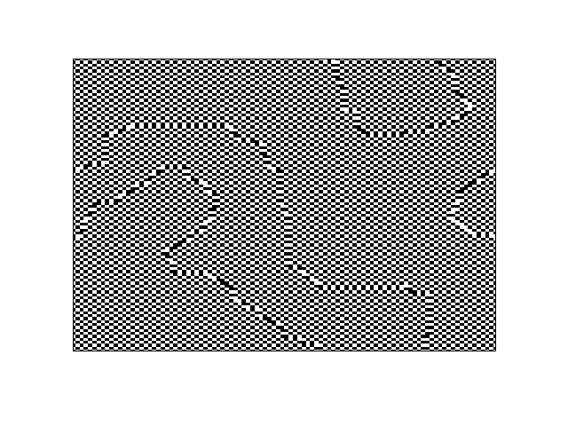

# Ising 
The ising model is used to simulate a system of spins on a squared lattice (in 2D) with nearest neighbour interaction. Such a model can be used to examine the behaviour of ferromagnets as they transition above the Curie temperature  into a disordered phase.

The Ising Hamiltonian has the form:

where J is an interspin coupling constant (set to 1 for simplicity)

## Images

#### T=1.7
Sub critical behaviour: clear separation of domains.

#### T=2.2
Near-critical behaviour: Merging of the domains.

#### T=3.0
Over critical behaviour: disordered phase, entropy takeover.

### Anti-ferromagnet configuration (Negative coupling term)
When the coupling term J becomes negative it is energetically favourable for spins to anti-allign in an anti-ferromagnetic phase. Different antiferromagnetic domains can be seen separated by domain walls.

