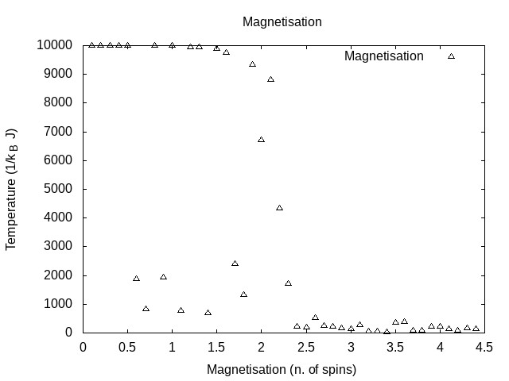

# Ising 

## Images

#### T=1.7
Sub critical behaviour: clear separation of phases.

#### T=2.2
Near-critical behaviour: Merging of the two phases.

#### T=3.0
Over critical behaviour: disordered phase, entropy takeover.

